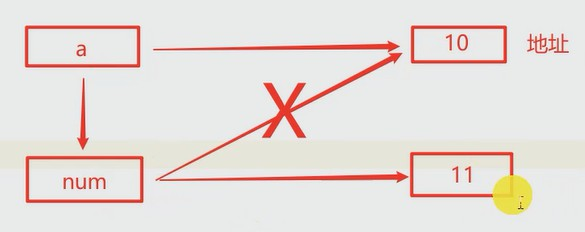
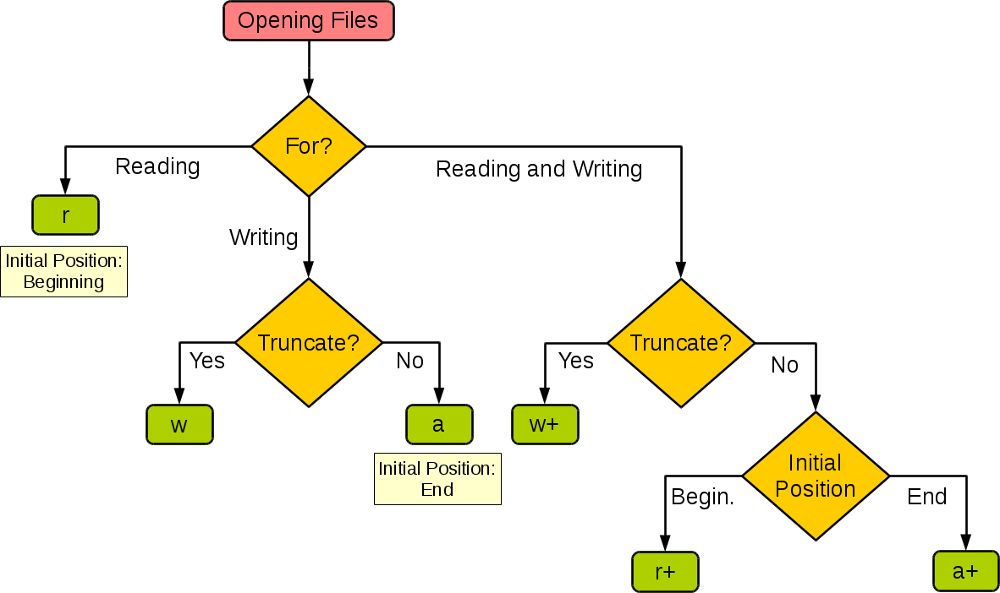

# 输入输出

```py
# name = input("please input your name: ");
name = 'tom'
age = 20
print("name is", name, "and age is", age)
# 使用占位符
print('name is %s and age is %d' % (name, age))
# 格式化输出
print('name is {} and age is {}'.format(name, age))
# 3.6版本后提供的简写
print(f'name is {name} and age is {age}')
```

print()后面可以添加多个参数，会自动添加空格将它们拼接起来。

# 运算符

逻辑运算符：

and or not

位运算符：

& | ~ ^(异或) >> <<

# 分支和循环

python 判断bool值的条件非常自由：

对于数字，Python 会把 0 和 0.0 当做“假”，把其它值当做“真”。

对于其它类型，当对象为空或者为 None 时，Python 会把它们当做“假”，其它情况当做真。

比如，下面的表达式都是不成立的：

"" #空字符串

[ ] #空列表

( ) #空元组

{ } #空字典

None #空值

# 字符串

find()方法查找字符串，返回索引。没找到返回`-1`

index()和find()作用一样，但是没有找到的时候抛出异常

rfind()、rindex()是从右边查找

count()求子串在字符串中出现的次数

replace()替换子串

split()切分字符串

join()把序列拼接成字符串

capitialize()将字符串中的单词首字母大写

upper()、lower()大小写转换

strip()删除两边空格。lstrip()、rstrip()删除单边的空格

starswith()	endswith()

isalpha()	isdigit()	isalnum()：字符串是否由数字或字母组成

issapce()：判断字符串是否全部由空白字符组成


字符串前边加上r，就变成了**原始字符串**，这种字符串不会转义。一般用在正则表达式里：
```python
import re


phone = input('输入手机号：')
m = re.match(r'^1\d{10}$', phone)
if not m:
    print('手机号格式错误')

```

# 函数

```python
def my_abs(a): # 不用写明返回值类型
    if not isinstance(a, (int, float)): # 判断类型
        return TypeError("非数字")
    if a < 0:
        return -a
    else:
        return a

print(my_abs('a'))
```

```python
def double(x, y):
    return x*2, y*2 # python返回一个元组，看起来像是多个返回值

x, y = double(1, 2) # 接收元组返回值。依赖于python的自动拆包装包机制

print(x, y)
```

像 Java 这样的参数在python中叫做位置参数，实参和形参是根据位置来对应的。python还支持关键字参数和可变参数（收集参数）。关键字参数的最大优点在于指定默认值。

```python
def power(x, n=2): #这个函数计算x的n次方，n默认是2
    s = 1
    while n > 0:
        s = s * x
        n = n -1
    return s
 
p = power # 函数是一等公民

print(p(2, 3))
print(p(2))
```

可以使用 name=value 这样的方式不按照默认的顺序传入参数。

下面是收集参数，将所有参数收集到一个元组中：

```python
def max(*numbers): # 可变参数
    max = -1
    for n in numbers:
        if n > max:
            max = n
    return max

print(max(1,2,3,4))

l = [1,2,3,4]
print(max(*l)) # 将list或者tuple作为可变参数传入
```

python还可以收集关键字参数，其实就是传入一个hashMap：

```python
def info(name, age, **other):
    print("name=", name, "age=", age, "other=", other)
       
info("Tom", 11) # name= Tom age= 11 other= {}
info("Jack", 22, city="Beijing") # name= Jack age= 22 other= {'city': 'Beijing'}
```

python不支持函数重载，如果一个文件中有两个同名的函数，后面的函数会覆盖前面的。但是因为python提供了多种传参的方式，最终的实现效果和函数重载相同。

> https://www.liaoxuefeng.com/wiki/1016959663602400/1017261630425888

## 高阶函数

python中函数是一等公民，可以当成变量使用。如果一个函数的参数是另一个函数，那么这个函数就是一个高阶函数（Higher-order function）

```python
def add(x, y, f):
    return f(x) + f(y)

print(add(1,-1,abs))
```

## 函数式编程

`map()`函数接收两个参数，一个是函数，一个是`Iterable`，`map`将传入的函数依次作用到序列的每个元素，并把结果作为新的`Iterator`返回。

```python
def f(x):
    return x*x

r = map(f, range(1,11)); # r是一个Iterator
l = list(r) # 把Iterator转成Iterable
print(l)
print(list(map(str, range(1,11)))) # 整型转成字符串
```

`reduce()`接收两个参数，一个归并函数和一个序列（ Iterable 或 Iterator）。

```python
from functools import reduce

def add(x,y):
    return x*10 + y

print(reduce(add, range(1,6))) # 12345
```

综合案例：

```python
from functools import reduce

# 字符串转成整数的方法
def str2int(s):
    DIGITS = {'0':0,'1':1,'2':2,'3':3,'4':4,'5':5,'6':6,'7':7,'8':8,'9':9}
    # 单个字符转整数
    def char2int(char):
        return DIGITS[char]
    def fn(x,y):
        return x*10 + y
    return reduce(fn, map(char2int, s))

print(str2int("123"))
```

filter()接受一个谓词函数和一个序列，过滤后返回 Iterator。

## 列表生成式

前面的这些流函数和配套的lambda表达式用的不多，更推荐使用列表生成式来代替。

## 函数作为返回值

```python
def lazy_sum(*args):
    def sum():
        sum = 0
        for num in args:
            sum = sum + num
        return sum
    return sum

f = lazy_sum(1,2,3) # 返回的不是求和结果，而是求和函数
print(type(f)) # <class 'function'>
print(f()) # 6
```

我们在函数`lazy_sum`中又定义了函数`sum`，并且，内部函数`sum`可以引用外部函数`lazy_sum`的参数和局部变量，当`lazy_sum`返回函数`sum`时，相关参数和变量都保存在返回的函数中，这种称为“闭包（Closure）”的程序结构拥有极大的威力。

请再注意一点，当我们调用`lazy_sum()`时，每次调用都会返回一个新的函数，即使传入相同的参数：

```python
f1 = lazy_sum(1,2,3)
f2 = lazy_sum(1,2,3)
print(f1 == f2)
```

## 闭包

当局部变量和全局变量同名时，在函数内部就无法访问全局变量了，因为它被遮盖了。

>Python查找一个变量时会按照“局部作用域”、“嵌套作用域”、“全局作用域”和“内置作用域”的顺序进行搜索，所谓的“内置作用域”就是Python内置的那些标识符，我们之前用过的`input`、`print`、`int`等都属于内置作用域。

我们可以使用`global`关键字来指示函数中的变量 x 来自于全局作用域，如果全局作用域中没有该变量，那么下面一行的代码就会定义变量`x`并将其置于全局作用域。同理，如果我们希望函数内部的函数能够修改嵌套作用域中的变量，可以使用`nonlocal`关键字来指示变量来自于嵌套作用域

```python
x = 'global'

def foo():
    x = 'local'
    print(x)
    
foo() # local
```

如果想要在函数内部访问被遮盖的全局变量，还可以使用 globals() 获取全局变量的字典：

```python
x = 'global'

def foo(x):
    print("local x is", x, "and global x is", globals()['x'])
    
foo('hello') # local x is hello and global x is global
```

在 Java 方法中改变全局变量的值很容易，但是python是动态语言，情况不一样：

```
int x = 1
public class foo() {
    x = 2 //java方法中修改全局变量的值
}

x = 1
def foo():
	x = 2 # python函数中定义了一个局部变量
```

要想让python解释器知道使用的变量是全局变量，需要使用global声明：

```python
x = 1
def foo():
    global x # 告诉python使用全局变量x
    x = 2 # 修改全局变量的值
```

python可以把一个函数放到另一个函数内。这种嵌套函数用处不大，但有一个很突出的用途：使用一个函数来创建另一个函数。

```python
def outer(factor):
    def inner(number):
        return number*factor
    return inner
```

这里一个函数位于另一个函数中，且外面的函数返回里面的函数。最重要的是，返回的函数可以访问其定义所在的作用域。换句话说，它携带着自己所在的环境（和相关的局部变量！）。这种特殊的函数叫做闭包，它的作用域可以保存值。

```python
def gen(*args):
    fn = []
    for n in args:
        def f():
            print(n)
        fn.append(f)
    return fn

f1, f2, f3 = gen(1,2,3)
f1() # 3
f2() # 3
f3() # 3
```

> https://zh.javascript.info/closure

关键字nonlocal和global的作用类似，在内部函数中修改嵌套作用域的变量时需要使用nonlocal声明：

```python
def outer(factor):
    def inner(number):
        nonlocal factor
        factor *= 2
        return factor + number
    return inner

foo = outer(1)
print(foo(1)) # 3
```

## 匿名函数

```python
l = list(map(lambda x: x*2, range(1,11)))
print(l)

f = lambda x, y: x + y # lambda只能有一个表达式
g = lambda a, b, c=3: a + b + c # lambda也能有默认值参数
h = lambda *args: print(args)
m = lambda a, b : a if a > b else b
print(f(1,1))


person = [
    {'name':'tom', 'age':10}, 
    {'name':'jack', 'age':20}, 
    {'name':'mary', 'age':28}
]
# 按照姓名排序
person.sort(key=lambda x : x['name'])
```

# 序列

list、tuple、str都是sequence，python提供了许多方便的语法特性。

切片操作符可以对方便的操作list：

```python
L = list(range(101))
T = tuple(range(101))

print(L[0:10]) # 索引从0开始，到10结束。不包括10 
print(L[-2:-1]) # 从倒数第二个数开始，倒数第一个数结束
L[1:5]=[] # 通过切片删除元素
L[0:0] = 100 # 替换索引为0的元素
print(L[::5]) # 步长5
print(T[:]) # 原样
print("hello world"[:5]) # 字符串切片
```

序列相加：

```python
>>> [1,2,3] + [4,5,6]
[1, 2, 3, 4, 5, 6]
>>> 'Hello,' + 'world!'
'Hello, world!'
>>> [1, 2, 3] + 'world!'
Traceback (innermost last):
File "<pyshell>", line 1, in ?
[1, 2, 3] + 'world!'
TypeError: can only concatenate list (not "string") to list

# ps:序列相加是返回一个新的列表，如果想要拓展原来的列表，使用extend方法
>>> a = [1,2,3]
>>> b = [4,5,6]
>>> a + b
[1, 2, 3, 4, 5, 6]
>>> a
[1, 2, 3]
>>> a.extend(b)
>>> a
[1, 2, 3, 4, 5, 6]
```

从错误消息可知，不能拼接列表和字符串，虽然它们都是序列。一般而言，不能拼接不同类
型的序列。  

将序列与数x相乘时，将重复这个序列x次来创建一个新序列：  

```python
>>> 'python' * 5
'pythonpythonpythonpythonpython'
>>> [42] * 10
[42, 42, 42, 42, 42, 42, 42, 42, 42, 42]
>>> [None]*3
[None, None, None]
```

python的for循环：

```python
T = tuple(range(10))
d = {'a':"abc", 'b':"bcd"} # hashMap在python里叫做字典
for t in T:
    print(t)
for k, v in d.items(): # 相当于java的entrySet
    print(k,"=",v)    
for index, t in enumerate(['a','b','c']): # 同时获取索引和值
    print(index, "=", t)
```

for、while循环都可以跟一个else语句，当循环正常结束（非break）后会执行else语句。

in 运算符还可以判断元素在不在一个列表中：

```
>>> name = 'tom'
>>> 't' in name
True
```

list(str) 可以方便的创建字符列表：

```
>>>list("hello")
['h','e','l','l','o']
```

列表生成式可以快速生成列表：

```python
L = [x for x in range(1, 11) if x % 2 == 0] # 1到10中偶数组成的list
L = [x * x for x in L] # 对列表中的每个元素平方
l1 = [x+y for x in "甲乙丙" for y in "123"] #全排列
L = [(i,j) for i in range(3) for j in range(4)]
d = {i:i**2 for i in range(3)} # 生成字典

d1 = ['name','age','sex']
d2 = ['tom', 20, 'male']
d = {d1[i]:d2[i] for i in range(len(d1))} # 两个列表分别做字典的key和value

print(L)
print(l1)
```

在一个列表生成式中，`for`前面的`if ... else`是表达式，而`for`后面的`if`是过滤条件，不能带`else`。

```python
l = [x if x % 2 == 0 else 0 for x in range(1, 11)]
print(l) # [0, 2, 0, 4, 0, 6, 0, 8, 0, 10]
```

集合推导式和列表推导式类似，但是使用`{}`，而且会去重：

```python
L = [1,1,2,3]
s = {i for i in L}
```

## 生成器

生成器generator有点像java的流，在用到的时候生成元素，可以节约内存。而不是像列表生成式那样一次性生成完毕：

```python
# 用列表的生成表达式语法创建列表容器
# 用这种语法创建列表之后元素已经准备就绪所以需要耗费较多的内存空间
f = [x ** 2 for x in range(1, 1000)]
print(sys.getsizeof(f))  # 查看对象占用内存的字节数
print(f)
# 请注意下面的代码创建的不是一个列表而是一个生成器对象
# 通过生成器可以获取到数据但它不占用额外的空间存储数据
# 每次需要数据的时候就通过内部的运算得到数据(需要花费额外的时间)
f = (x ** 2 for x in range(1, 1000))
print(sys.getsizeof(f))  # 相比生成式生成器不占用存储数据的空间
print(f)
next(f) # 使用next调用生成器
next(f)
for val in f: # 生成器也可以迭代
    print(val)
```

除了使用上面的生成器语法，python还支持使用yield关键字将一个普通函数改造成生成器函数。下面是一个斐波那契数列的生成器函数：

```python
def fib(n):
    a, b = 0, 1
    for _ in range(n):
        a, b = b, a + b
        yield a


if __name__ == '__main__':
    for val in fib(20):
        print(val, end=' ')

```

> https://www.liaoxuefeng.com/wiki/1016959663602400/1017318207388128

list、tuple、dict、set、str都是 Iterable 类型，可以使用 for ... in 循环。生成器这种可以使用 next() 取值的是 Iterate 类型。生成器都是`Iterator`对象，但`list`、`dict`、`str`虽然是`Iterable`，却不是`Iterator`。把`list`、`dict`、`str`等`Iterable`变成`Iterator`可以使用`iter()`函数

```python
s1 = {1,2,3,4,5}
s2 = {3,4,5,6,7}

# 交集
print(s1 & s1)
# 并集 效果和加号拼接一样
print(s1 | s2)
# 差集
print(s1 - s2)
```

`ipython`是一个功能更强的CLI，在cmd中输入`ipython`就可以使用。可以使用`ipython`中的`%timeit`语句来查询元组和列表的创建开销：
```shell
In [1]: %timeit [1,2,3,4,5]
41.6 ns ± 1.71 ns per loop (mean ± std. dev. of 7 runs, 10,000,000 loops each)

In [2]: %timeit (1,2,3,4,5)
7.11 ns ± 0.0684 ns per loop (mean ± std. dev. of 7 runs, 100,000,000 loops each)
```

# exec和eval

# pip

## 换源

在文件管理器地址栏输入`%APPDATA%`，新建pip文件加，新建pip.ini文件，配置如下：

```
[global]
index-url = https://pypi.tuna.tsinghua.edu.cn/simple
[install]
use-mirrors =true
mirrors = https://pypi.tuna.tsinghua.edu.cn/simple
trusted-host = https://pypi.tuna.tsinghua.edu.cn
```

> https://www.jianshu.com/p/d02d0b16163b

## pip search失效

> https://blog.csdn.net/shmily_ke/article/details/122463792

# 类

## 定义

python3中的类叫做新式类，因为它默认继承了object类。

```python
# python3默认是新式类
class Person:
    count = 0  # 类属性
    
    def __init__(self, name, age) -> None:
        super().__init__()
        self.name = name
        self.age = age
        Person.count += 1 # 用类名调用类属性

    def set_name(self, name):
        self.name = name
    # 其实python可以直接在类外部定义属性 p1.address = 'shanghai'

    # 相当于 Java 的toString()
    def __str__(self) -> str:
        return f'{self.name} is {self.age} years old'

    # 析构器
    def __del__(self):
        print(f'{self.name} 被删除了')


p1 = Person('tom', 20)
print(p1)
print(Person.count) # 类属性可以用 类名.属性名 调用，也可以使用 变量名.属性名 调用
del p1

```

python是动态语言，不能在类中显式声明成员变量。所以如果想要使用隐式参数，需要声明方法的第一个参数是self。

## 魔术方法

双下划线开头的是魔术方法，python定义了很多魔术方法，比如在创建对象时会自动调用`__init__`方法。

和 Java 一样，`print(对象名)`默认打印地址。魔术方法`__str__()`和 Java 的 toString() 方法作用一样。

`__del__()`析构方法，在 GC 回收对象时调用，和 Java 的 finalize() 类似。一般用不上，最常见的情况是把关闭文件、关闭连接的方法封装起来。

只要是面向对象的编程语言，类的实例化都一定包含两个步骤： （1）在内存中创建对象，即开辟一块内存空间来存放类的实例（Instance）； （2）初始化对象，即给实例的属性赋予初始值，例如全部填 0；在 python 中，第一步由` __new__ `函数负责，第二步由` __init__ `函数负责。要想在python中实现单例模式，必须重写`__new__`方法。`__new__`是object类的静态方法，通常这样调用：`super().__new__(cls)`

```python
class MusicPlayer:
    
    instance = None
    
    def __new__(cls, *args, **kwords):
        if cls.instance is None:
            cls.instance = super().__new__(cls)
        return cls.instance
    
    def __init__(self, song) -> None:
        self.song = song
    
    def start(self):
        print(f'{self.song}开始播放')
        

m1 = MusicPlayer('晴天')
print(m1)  # 打印对象的地址
m2 = MusicPlayer('夜曲')
print(m2)
```

`__name__`变量，如果在文件内部打印，会展示`__main__`。如果引入模块，会打印模块名。这个变量常用来在自定义模块中测试使用，可以编写程序的入口。

```python
def main():
    pass 

if __name__ == '__main__':  # 程序的入口
    main()  
```

`__file__`代表文件的位置。`print(random.__file__)`

`__all__`这是一个列表，决定了模块中哪些功能可以被其他文件引入。


## 封装

```python
class Person:
    def __init__(self, name, age) -> None:
        self.__name = name
        self.__age = age  # 私有属性
        
    def set_age(self, age):
        self.__age = age
        
    def get_age(self):
        return self.__age
    

girl = Person('mary', 19)
girl.set_age(18)
print(girl.get_age())
```
上面其实是Java的写法，python还提供了两个装饰器，可以把私有变量当成公共变量使用：

`@name.setter`标记name属性的setter，`@property`标记方法是一个getter。Python是动态语言，允许我们在程序运行时给对象绑定新的属性或方法，当然也可以对已经绑定的属性和方法进行解绑定。但是如果我们需要限定自定义类型的对象只能绑定某些属性，可以通过在类中定义\_\_slots\_\_变量来进行限定。需要注意的是\_\_slots\_\_的限定只对当前类的对象生效，对子类并不起任何作用。

```python
class Person(object):

    # 执行可以包含属性
    __slots__ = ('__name', '__age')

    # python只有公共和私有两种访问权限
    # 程序员常用单下划线开头的名称暗示这是一个受保护的属性
    def __init__(self, name, age) -> None:
        super().__init__()
        self.__name = name
        self.__age = age

    # 代表getter
    @property
    def age(self) -> int:
        return self.__age
    
    # 代表setter
    @age.setter
    def age(self, age) -> None:
        self.__age = age

    def __str__(self) -> str:
        return f'{self.__name}, 今年{self.__age}岁'


if __name__ == '__main__':

    p1 = Person('tom', 11)
    print(p1)
    p1.age = 12  # 像公共属性一样使用
    print(p1.age)


```
## 继承

python支持多重继承：
```python
# 计算器类
class Calculator:
    def calc(self, expression):
        self.value = eval(expression)
# 语音类
class Talker:
    def talk(self):
        print("the value is", self.value)
# 语音计算器     
class CalTalker(Calculator, Talker):
    pass

cal = CalTalker()
cal.calc("1 + 2")
cal.talk() # the value is 3
```

被继承的多个父类如果有同名的方法，必须注意class语句里父类的排列顺序，位于前面的类的方法将覆盖位于后面的类的方法。因此，在前面的示例中， 如果Calculator类包含方法talk，那么这个方法将覆盖Talker类的方法talk  。
python父类的私有成员不会被继承。

子类使用 `super()`调用父类的属性和方法

MRO(method resolution order)：方法解析顺序。可以通过`className.__mro__`或`className.mro()`获取类的层次结构，方法解析顺序也是按这个层次结构得到的。

```python
class Animal:
    def run():
        print("running")
        
class Dog(Animal):
    def run():
        print("dog running")
        
print(Dog.mro())  # [<class '__main__.Dog'>, <class '__main__.Animal'>, <class 'object'>]
# 通过上面的MRO知道，如果调用Dog实例的某个方法时，会依次到类Dog、Animal、object中寻找
```

## 多态

python的多态被成为鸭子类型，比java的更加自由。python的多态不需要继承。

如果要确定对象包含哪些方法或属性，有一些函数可供你用来完成这种工作。
```python
class Pig:
    def eat():
        print("pig eat beef")
    
pig = Pig()
print(hasattr(pig, 'eat')) # True
e = getattr(pig, 'eat', None) # 对象不存在属性，就返回None
print(e) # <bound method Pig.eat of <__main__.Pig object at 0x0000022A8FF7AE90>>
```

## 类属性和类方法和静态方法

```python
class Person:
    __count = 0  # 私有类属性
    def __init__(self, name) -> None:
        self.name = name
        Person.__count += 1
        
    @classmethod  # 类方法的修饰器
    def get_count(cls):  # cls代表本类，通过cls调用类的属性和方法
        return cls.__count
    
p1 = Person('tom')
p2 = Person('mary')
print(Person.get_count())  # 2
```

python如果一个类方法可以单独发挥作用，不需要访问其他的类成员、实例成员，那么可以把这个类方法定义成静态方法。一些工具类中常见静态方法。

```python
class MyMath:
    
    @staticmethod
    def add(a, b):
        return a + b
    
    
print(MyMath.add(1,2))
```

## 抽象类

python语法不支持抽象类，但可以通过`abc`模块的`ABCMeta`元类和`abstractmethod`包装器来达到抽象类的效果：

```python
from abc import ABCMeta, abstractmethod


# 宠物抽象类
class Pet(object, metaclass=ABCMeta):

    def __init__(self, name):
        super().__init__()
        self._name = name

    # 抽象方法
    @abstractmethod
    def make_voice(self):
        pass


class Dog(Pet):

    def make_voice(self):
        print(self._name, '汪汪汪')


class Cat(Pet):

    def make_voice(self):
        print(self._name, '喵喵喵')


if __name__ == '__main__':
    pets = [Dog('旺财'), Cat('凯蒂'), Dog('大黄')]
    for pet in pets:
        pet.make_voice()

```

# 异常处理

try...except...else...finally

else是不发生异常时执行的代码。finally无论发布发生异常都会执行。

```python
try:
    x = input("输入除数：")
    y = input("输入被除数：")
    print("x/y=", x/y)
except ZeroDivisionError as e:
    print("被除数为0错误")
    print(e)
    raise ArithmeticError("算术错误")
```

except 后面不指定认为异常类型，则捕获所有的异常。

raise 手动抛出异常。

# 引用类型和不可变对象

python中的变量都是引用类型，比如 `x = 10`：在C语言中，会把10保存在栈中，然后通过变量表记录x指向的栈中的地址。但是python是动态数据类型，底层其实都是一个Python_Object对象，所以x会指向数据区（不是堆）的一块地址。

```python
x = y = 10

# 打印变量的地址
print(id(x)) # 2455039509008
print(id(y)) # 2455039509008
```

在python中，int、float、bool、str、tuple都是不可变对象：

```python
x = y = 10
# 改变x的值，会创建一个新的引用
x = 100
# y的引用不变，所以还是10
print(y)
```

而list、set、dict是可变类型。

python函数都是值传递，传递的是地址的值：

```python
a = 10
def foo(num):
    num += 1
    
foo(a) # 传入a的地址

print(a) # 10
```

上面代码内存图如下：和Java不一样的是，Java中基础类型的值会被复制，而python中所有类型都是python_object，所以传递的都是地址的值



```python
import copy

# 浅复制
l1 = [1, [2, 3], {4: '5'}]
l2 = list(l1)
print(id(l1[1]))
print(id(l2[1]))

# 深拷贝
l3 = copy.deepcopy(l1)
print(id(l3[1]))
```


# 文件操作

1. 打开文件
2. 读写文件
3. 关闭文件

```python
# f = open(path, mode) mode=r只读、w写入、a追加模式
# f是返回的file对象
f = open('D:/Code/hello.txt', 'w')
f.write("你好 python") # 使用系统编码，中文默认是GBK。此方法不会换行
f.close()
```

模式的选择：



解决中文乱码：

```python
f = open('D:/code/hello.txt', 'w', encoding='utf-8')
```

```python
f.read() #读取文件所有内容，支持二进制文件
f.read(1024) #读取1024个字符
f.readlines() #读取文本文件的所有行，返回一个list
```

> python标准库内置函数open：https://docs.python.org/zh-cn/3/library/functions.html#open

f.seek(移动距离，起始位置)：此方法用来移动文件指针，单位是字节

## os模块

os.rename(ole_file_name, new_file_name);

os.remove(file_name)

os.mkdir()

os.getcwd()获取当前目录

os.chdir()切换目录

os.listdir() 列出文件

os.rmdir()删除空目录

递归删除目录：

```python
import shutil

# 递归删除目录
shutil.rmtree('images')
```

# 模块

模块就是一个 .py 文件。

## 导入

1. import 模块名1，模块名2
   会导入模块的所有方法，使用时需要加上模块名
2. import 模块名 as 别名
   为模块起个别名
3. from 模块名 import 功能名
   只会导入特定的成员（类、方法、全局变量），使用时不需要模块名
4. from 模块名 import *
   导入模块的所有成员，使用时不需要模块名
5. from 模块名 import 方法名 as 方法别名

```python
from multiprocessing.spawn import import_main_path
from time import time as t

start = t()
for i in range(1000):
    pass
end = t()
print('执行时间是', end - start)
```

多个模块中命名冲突时，后导入的模块的名字会覆盖前面的模块。推荐为重名的方法起别名。

自定义的模块不能和系统模块重名。

需要说明的是，如果我们导入的模块除了定义函数之外还有可以执行代码，那么Python解释器在导入这个模块时就会执行这些代码，事实上我们可能并不希望如此，因此如果我们在模块中编写了执行代码，最好是将这些执行代码放入如下所示的条件中，这样的话除非直接运行该模块，if条件下的这些代码是不会执行的，因为只有直接执行的模块的名字才是`__main__`

mymodule.py
```python
def foo():
    pass
	
	
# __name__是Python中一个隐含的变量它代表了模块的名字
# 只有被Python解释器直接执行的模块的名字才是__main__
if __name__ == '__main__':
    print('call foo()')
    foo()
    pass
```
test.py
```python
import mymodule

# 导入mymodule时 不会执行模块中if条件成立时的代码 因为模块的名字是mymodule而不是__main__
```

## 包

将多个模块放到一个文件夹里，并创建一个`__init__.py`文件，那么这个文件夹就变成了一个包。必须在`__init__.py`文件中添加`__all__`，指定可以导入的模块。注意限制只对使用 * 号导入的方式起作用，如果使用模块名导入的话时没有办法限制的。

```python
# 导入方式1
import 包名.模块名
包名.模块名.方法名()

# 导入方式2 具体导入哪些模块由__init__.py指定
import 包名
包括.模块名.方法名()

# 导入方式2
from 包名 import 模块名
模块名.方法名()
```

# 并发

## 多进程

windows和linux的多进程代码不一样：

```python
# 1.导包
import multiprocessing
import time


def dance():
    print('开始跳舞')
    time.sleep(1)
    print('结束跳舞')


def sing():
    print('开始唱歌')
    time.sleep(1)
    print('结束唱歌')


# 2.创建子进程
# target:进程执行的目标任务
# name:默认是 process-1
if __name__ == '__main__':
    dance_process = multiprocessing.Process(target=dance)
    sing_process = multiprocessing.Process(target=sing)
    # 3. 启动子进程
    dance_process.start()
    sing_process.start()


```

>  [Python 多进程报错问题 - 易公子 - 博客园 (cnblogs.com)](https://www.cnblogs.com/yigongzi/p/14273412.html) 

### 进程id

```python
# 1.导包
import multiprocessing
import os
import time


def dance():
    # 获取进程id，用来判断是哪个进程在执行这个任务
    print(os.getpid())
    # multiprocessing.current_process()
    # 获取父进程id
    print(os.getppid())
    for i in range(3):
        print('dancing')
        time.sleep(0.2)


def sing():
    print(os.getpid())
    print(os.getppid())
    for i in range(3):
        print('singing')
        time.sleep(0.2)

# 一个main进程启动了两个子进程
if __name__ == '__main__':
    dance_process = multiprocessing.Process(target=dance)
    sing_process = multiprocessing.Process(target=sing)
    # 3. 启动子进程
    dance_process.start()
    sing_process.start()
```

### 杀死进程

```python
import multiprocessing
import time
import os


def sing():
    sing_pid = os.getpid()
    for i in range(3):
        print('singing')
        time.sleep(0.1)
        # 执行一次之后就杀死进程
        # 9代表强制
        os.kill(sing_pid, 9)


if __name__ == '__main__':
    sing_process = multiprocessing.Process(target=sing)
    sing_process.start()

```

### 传参

创建进程的时候可以指定参数，args以元组传参，kwargs以字典传参。

```python
import multiprocessing


def show_info(name, age):
    print(name, age)


if __name__ == '__main__':
    sub_process = multiprocessing.Process(target=show_info, args=('李白', 33))
    sub_process.start()

    sub_process2 = multiprocessing.Process(target=show_info, kwargs={'name': '张飞', 'age': 22})
    sub_process2.start()
```

### 进程特点

1. 进程之间不共享全局变量

```python
import multiprocessing


# 全局变量
g_list = []


def add_data():
    global g_list
    for i in range(3):
        g_list.append(i)
        print('add', i)


def read_data():
    global g_list
    print('read', g_list)


if __name__ == '__main__':
    # 这个进程向全局变量添加数据
    sub_process = multiprocessing.Process(target=add_data)
    sub_process.start()
    # 这个进程读取全局变量
    read_process = multiprocessing.Process(target=read_data)
    read_process.start()
```

2. 主进程在所有子进程结束后才结束。如果想要主进程不等待子进程结束就自动结束，可以把子进程设置称为守护进程，这样主进程退出所有子进程也会销毁。或者调用`sub_process.terminate()`。

   ```python
   sub_process = multiprocessing.Process(target=sing, daemon=True)
   sub_process.daemon = True
   ```


## 多线程

进程是资源分配的基本单位，线程是cpu执行的基本单位。使用多线程实现并发，不同的线程之间可以共享内存中的变量。

```python
# 1.导入模块

import threading
import time


def sing():
    for i in range(3):
        print('singing')
        time.sleep(0.1)


def dance():
    for i in range(3):
        print('dancing')
        time.sleep(0.1)


if __name__ == '__main__':
    # 2.创建多线程
    sing_thread = threading.Thread(target=sing)
    dance_thread = threading.Thread(target=dance)

    # 3. 启动多线程
    sing_thread.start()
    dance_thread.start()
```

传参的方法，设置线程名、获取当前线程等方法和多进程相同。

多线程还可以通过继承Thread类来实现：

```python
# 1.导入模块
import os
import threading
import time


# 继承Thread类
class SingTask(threading.Thread):

    def __init__(self, song):
        super().__init__()
        self._song = song

    # 这个方法就是要执行的任务
    def run(self):
        print('开始唱歌：', self._song, '进程id', os.getpid())
        time.sleep(1)
        print('唱完了')


if __name__ == '__main__':
    # 2.创建多线程
    pop = SingTask('流星雨')
    rock = SingTask('rock n roll')

    # 3. 启动多线程
    pop.start()
    rock.start()
````

### 共享全局变量

```python

# 1.导入模块

import threading
import time

g_list = []


def add_data():
    for i in range(3):
        g_list.append(i)
        print('add', i)
        time.sleep(0.2)


def read_data():
    print(g_list)


if __name__ == '__main__':
    # 2.创建多线程
    add_thread = threading.Thread(target=add_data)
    read_thread = threading.Thread(target=read_data)

    # 3. 启动多线程
    add_thread.start()
    add_thread.join()
    read_thread.start()
```

### 数据竞争

多线程同时写入全局变量会出错，有两种解决办法：

1. 线程等待：join
2. 互斥锁

```python
import threading

g_num = 0

// 创建互斥锁
lock = threading.Lock()


// 循环100万次的任务
def task1():
    # 上锁
    lock.acquire()
    for i in range(1000000):
        global g_num
        g_num += 1
    print('task1, g_num=', g_num)
    # 释放锁
    lock.release()


def task2():
    # 上锁
    lock.acquire()
    for i in range(1000000):
        global g_num
        g_num += 1
    print('task1, g_num=', g_num)
    # 释放锁
    lock.release()


if __name__ == '__main__':
    first_thread = threading.Thread(target=task1)
    second_thread = threading.Thread(target=task2)

    first_thread.start()
    second_thread.start()

```

## 多进程和多线程的选择

多进程可以利用多个cpu，多线程只能使用一个cpu。

只有计算密集型任务，为了利用多核的情况使用多进程。一般都使用多线程，因为资源消耗小。

# 网络编程

客户端：

导入 socket 模块 **import socket**

创建客户端 socket 对象 **socket.socket(AddressFamily, Type)**

**参数说明:**

- AddressFamily 表示IP地址类型, 分为TPv4和IPv6
- Type 表示传输协议类型
	- SOCK_STREAM TCP套接字
    - type=SOCK_DGRAM UDP套接字
    - type=SOCK_RAW 原始套接字

**方法说明:**

- connect((host, port)) 表示和服务端套接字建立连接, host是服务器ip地址，port是应用程序的端口号
- send(data) 表示发送数据，data是二进制数据
- recv(buffersize) 表示接收数据, buffersize是每次接收数据的长度


```python
import socket


if __name__ == '__main__':
    # 1.创建客户端socket
    # 第一个socket是模块名，第二个是类名
    # 第一个参数是ipv4, 第二个代表tcp
    client_socket = socket.socket(socket.AF_INET, socket.SOCK_STREAM)

    # 2. 建立连接
    client_socket.connect(('localhost', 8080))
    # 3. 发送数据
    client_socket.send('hello server'.encode('gbk'))
    # 4. 接收数据，最多接收1024个字节
    recv_data = client_socket.recv(1024).decode('gbk')
    print('接受的响应：', recv_data)

    # 5. 关闭连接
    client_socket.close()
```

服务端：

**方法说明:**

- bind((host, port)) 表示绑定端口号, host 是 ip 地址，port 是端口号，ip 地址一般不指定，表示本机的任何一个ip地址都可以。
- listen (backlog) 表示设置监听，backlog参数表示最大等待建立连接的个数。
- accept() 表示等待接受客户端的连接请求。这是一个阻塞方法，没有收到客户端连接请求时，代码不会向下执行
- send(data) 表示发送数据，data 是二进制数据
- recv(buffersize) 表示接收数据, buffersize 是每次接收数据的长度

```python
import socket


if __name__ == '__main__':
    server_socket = socket.socket(socket.AF_INET, socket.SOCK_STREAM)
    # 服务端绑定8080端口
    server_socket.bind(('localhost', 8080))
    # 开始监听 设置最大等待连接的个数
    server_socket.listen(128)

    # 等待连接请求
    # 返回元组，第一个元素是随机分配了端口的socket，第二个元素是客户端的地址
    dynamic_socket, client_address = server_socket.accept()
    print('客户端ip和端口:', client_address)

    # 接收数据
    request_data = dynamic_socket.recv(1024).decode('gbk')
    print('接收的请求：', request_data)
    # 返回数据
    dynamic_socket.send('hello client'.encode('gbk'))

    # 关闭连接
    dynamic_socket.close()
    server_socket.close()
```

## 端口号复用

当客户端和服务端建立连接后，**服务端程序退出后绑定的端口号不会立即释放，需要等待大概1-2分钟。**

解决办法有两种:

1. 更换服务端端口号
2. 设置端口号复用(推荐大家使用)，也就是说让服务端程序退出后端口号立即释放。

设置端口号复用的代码如下:

```
# 参数1: 表示当前套接字
# 参数2: 设置端口号复用选项
# 参数3: 设置端口号复用选项对应的值
server_socket.setsockopt(socket.SOL_SOCKET, socket.SO_REUSEADDR, True)
```

## 注意

1. 当 TCP 客户端程序想要和 TCP 服务端程序进行通信的时候必须要先**建立连接**
2. TCP 客户端程序一般不需要绑定端口号，因为客户端是主动发起建立连接的。
3. **TCP 服务端程序必须绑定端口号**，否则客户端找不到这个 TCP 服务端程序。
4. listen 后的套接字是被动套接字，**只负责接收新的客户端的连接请求，不能收发消息。**
5. 当 TCP 客户端程序和 TCP 服务端程序连接成功后， TCP 服务器端程序会产生一个**新的套接字**，收发客户端消息使用该套接字。
6. **关闭 accept 返回的套接字意味着和这个客户端已经通信完毕**。
7. **关闭 listen 后的套接字意味着服务端的套接字关闭了，会导致新的客户端不能连接服务端，但是之前已经接成功的客户端还能正常通信。**
8. **当客户端的套接字调用 close 后，服务器端的 recv 会解阻塞，返回的数据长度为0**，服务端可以通过返回数据的长度来判断客户端是否已经下线，反之**服务端关闭套接字，客户端的 recv 也会解阻塞，返回的数据长度也为0**。

## 服务端多线程

上面代码中的accept()、recv()方法都是阻塞的，所以服务端只能同时和一个客户端通信。如果想要同时和多个客户端通信，需要改成多线程。

```python
import socket
import threading


def response(dynamic_socket, client_address):
    print('客户端ip和端口:', client_address)
    # 接收数据
    request_data = dynamic_socket.recv(1024).decode('gbk')
    print('接收的请求：', request_data)
    # 返回数据
    dynamic_socket.send('hello client'.encode('gbk'))
    # 关闭连接
    dynamic_socket.close()


if __name__ == '__main__':
    server_socket = socket.socket(socket.AF_INET, socket.SOCK_STREAM)
    # 服务端绑定8080端口
    server_socket.bind(('localhost', 8080))
    # 开始监听 设置最大等待连接的个数
    server_socket.listen(128)

    # 循环等待连接请求
    while True:
        new_socket, address = server_socket.accept()
        # 创建子线程
        sub_thread = threading.Thread(target=response, args=(new_socket, address))
        # 启动子线程
        sub_thread.start()

```

